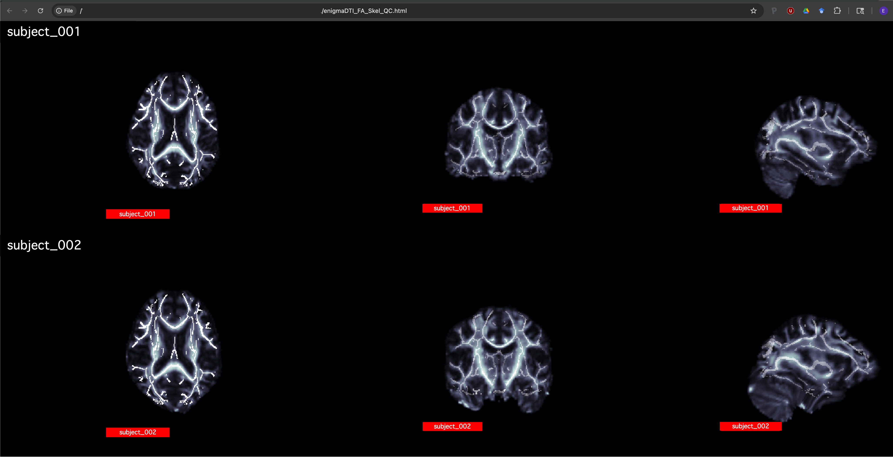

# Table of Contents
- [Protocol for TBSS analysis using the ENIGMA-DTI template](#protocol-for-tbss-analysis-using-the-enigma-dti-template)
- [Protocol for ROI analysis using the ENIGMA-DTI template](#protocol-for-roi-analysis-using-the-enigma-dti-template)
- [Protocol for applying TBSS skeletonizations from FA to diffusivity measures](#protocol-for-applying-tbss-skeletonizations-from-fa-analysis-to-diffusivity-and-obtaining-roi-measures-using-the-enigma-dti-template)
- [Quality control protocols](#quality-control-protocols)
- [Additional QC tools](#additional-qc-tools)


# Protocol for TBSS analysis using the ENIGMA-DTI template

Neda Jahanshad, Emma Sprooten, Peter Kochunov
##### (Last update April 2014)

The following steps will allow you to register and skeletonize your FA images to the DTI atlas being used for ENIGMA-DTI for tract-based spatial statistics (TBSS; Smith et al., 2006). A wrapper script is also made available at the bottom of this page.

Here we assume preprocessing steps including motion/Eddy current correction, masking, tensor calculation, and creation of FA maps has already been performed, along with quality control. A QC protocol for vector alignment is made available in this repository [here](vector_QC/).

Further instructions for using FSL, particularly TBSS can be found on the website: https://fsl.fmrib.ox.ac.uk/fsl/fslwiki/TBSS

1. Download a copy of the ENIGMA-DTI template FA map, edited skeleton, masks and corresponding distance map from this repository (folder titled [enigmaDTI](enigmaDTI/)). The downloaded archive will have the following files:
    - ENIGMA_DTI_FA.nii.gz
    - ENIGMA_DTI_FA_mask.nii.gz
    - ENIGMA_DTI_FA_skeleton.nii.gz
    - ENIGMA_DTI_FA_skeleton_mask.nii.gz
    - ENIGMA_DTI_FA_skeleton_mask_dst.nii.gz

2. Copy all FA images into a folder

        cp /subject*_folder/subject*_FA.nii.gz /enigmaDTI/TBSS/run_tbss/

3. cd into directory and erode images slightly with FSL

        cd /enigmaDTI/TBSS/run_tbss/
        tbss_1_preproc *.nii.gz

This will create a ./FA folder with all subjects eroded images and place all original ones in a ./origdata folder

4. Register all subjects to template. Can choose registration method that works best for your data (_as a default use TBSS_)

        tbss_2_reg -t ENIGMA_DTI_FA.nii.gz
        tbss_3_postreg -S

Make sure to QC images to ensure good registration! ***if any maps are poorly registered, move them to another folder

        mkdir /enigmaDTI/TBSS/run_tbss/BAD_REGISTER/
        mv FA_didnt_pass_QC* /enigmaDTI/TBSS/run_tbss/BAD_REGISTER/

**NOTE:** If your field of view is different from the ENIGMA template – (example, you are missing some cerebellum/temporal lobe from your FOV) or you find that the ENIGMA mask is somewhat larger than your images, please follow Steps 5 and 6 to remask and recreate the distance map. Otherwise, continue to use the distance map provided

5. Make a new directory for your edited version:

         mkdir /enigmaDTI/TBSS/ENIGMA_targets_edited/

Create a common mask for the specific study and save as:

         /enigmaDTI/TBSS/ENIGMA_targets_edited/mean_FA_mask.nii.gz

One option to create a common mask for your study (in ENIGMA space) is to combine all well registered images and see where most subjects (here 90%) have brain tissue using FSL tools and commands:

        cd /enigmaDTI/TBSS/run_tbss/

        ${FSLPATH}/fslmerge –t ./all_FA_QC ./FA/*FA_to_target.nii.gz
        ${FSLPATH}/fslmaths ./all_FA_QC -bin -Tmean –thr 0.9 /enigmaDTI/TBSS/ENIGMA_targets_edited/mean_FA_mask.nii.gz

**NOTE:** This is another opportunity to QC your images at this stage! `./all_FA_QC.nii.gz` is a 4D nifti file comprised of each subject’s registered FA. View `./all_FA_QC.nii.gz` in movie mode in `fslview` or `fsleyes` to easily spot misregistrations or large deviations between volumes (i.e. subjects).

<p align="center">

</p>

Mask and rename ENIGMA_DTI templates to get new files for running TBSS:

        ${FSLPATH}/fslmaths /enigmaDTI/TBSS/ENIGMA_targets/ENIGMA_DTI_FA.nii.gz –mas /enigmaDTI/TBSS/ENIGMA_targets_edited/mean_FA_mask.nii.gz /enigmaDTI/TBSS/ENIGMA_targets_edited/mean_FA.nii.gz

        ${FSLPATH}/fslmaths /enigmaDTI/TBSS/ENIGMA_targets/ENIGMA_DTI_FA_skeleton.nii.gz –mas /enigmaDTI/TBSS/ENIGMA_targets_edited/mean_FA_mask.nii.gz /enigmaDTI/TBSS/ENIGMA_targets_edited/mean_FA_skeleton.nii.gz

Your folder should now contain:

        /enigmaDTI/TBSS/ENIGMA_targets_edited/mean_FA.nii.gz
        /enigmaDTI/TBSS/ENIGMA_targets_edited/mean_FA_mask.nii.gz
        /enigmaDTI/TBSS/ENIGMA_targets_edited/mean_FA_skeleton.nii.gz

6. cd into directory where you have newly masked ENIGMA target and skeleton to create a distance map

        tbss_4_prestats -0.049

The distance map will be created but the function will return an error because the all_FA is not included here. This is ok! The skeleton has already been thresholded here so we do not need to select a higher FA value (ex 0.2) to threshold.

It will output:

        /enigmaDTI/TBSS/ENIGMA_targets_edited/mean_FA_skeleton_mask_dst

Your folder should now contain at least:

        /enigmaDTI/TBSS/ENIGMA_targets_edited/mean_FA.nii.gz
        /enigmaDTI/TBSS/ENIGMA_targets_edited/mean_FA_mask.nii.gz
        /enigmaDTI/TBSS/ENIGMA_targets_edited/mean_FA_skeleton.nii.gz
        /enigmaDTI/TBSS/ENIGMA_targets_edited/mean_FA_skeleton_mask.nii.gz
        /enigmaDTI/TBSS/ENIGMA_targets_edited/mean_FA_skeleton_mask_dst.nii.gz

**NOTE:** For the following steps, if you use the ENIGMA mask and distance map as provided, in the commands for steps 7 and 8 replace:

`/enigmaDTI/TBSS/ENIGMA_targets_edited/mean_FA_mask.nii.gz` with `/enigmaDTI/TBSS/ENIGMA_targets/ENIGMA_DTI_FA_mask.nii.gz`

and `/enigmaDTI/TBSS/ENIGMA_targets_edited/mean_FA_skeleton_mask_dst` with `/enigmaDTI/TBSS/ENIGMA_targets/ENIGMA_DTI_FA_skeleton_mask_dst`


7. For faster processing or parallelization, it is helpful to run the projection on one subject at a time. Move each subject FA image into its own directory and (if masking was necessary as in steps 5 and 6 above) mask with common mask. This can be parallelized on a multiprocessor system if needed.

        cd /enigmaDTI/TBSS/run_tbss/

        for subj in subj_1 subj_2 … subj_N
        do

        mkdir -p ./FA_individ/${subj}/stats/
        mkdir -p ./FA_individ/${subj}/FA/

        cp ./FA/${subj}_*.nii.gz ./FA_individ/${subj}/FA/

        ####[optional/recommended]####
        ${FSLPATH}/fslmaths ./FA_individ/${subj}/FA/${subj}_*FA_to_target.nii.gz -mas /enigmaDTI/TBSS/ENIGMA_targets_edited/mean_FA_mask.nii.gz ./FA_individ/${subj}/FA/${subj}_masked_FA.nii.gz

        done

8. Skeletonize images by projecting the ENIGMA skeleton onto them:

        cd /enigmaDTI/TBSS/run_tbss/
        for subj in subj_1 subj_2 … subj_N
        do

        ${FSLPATH}/tbss_skeleton -i ./FA_individ/${subj}/FA/${subj}_masked_FA.nii.gz -p 0.049 /enigmaDTI/TBSS/ENIGMA_targets_edited/mean_FA_skeleton_mask_dst ${FSLPATH}/data/standard/LowerCingulum_1mm.nii.gz ./FA_individ/${subj}/FA/${subj}_masked_FA.nii.gz ./FA_individ/${subj}/stats/${subj}_masked_FAskel.nii.gz -s /enigmaDTI/TBSS/ENIGMA_targets_edited/mean_FA_skeleton_mask.nii.gz

        done

Congrats! Now you have all your images in the ENIGMA-DTI space with corresponding projections.

All your skeletons are:

        /enigmaDTI/TBSS/run_tbss/FA_individ/${subj}/stats/${subj}_masked_FAskel.nii.gz

# Protocol for ROI analysis using the ENIGMA-DTI template
Neda Jahanshad, Rene Mandl, Peter Kochunov
neda.jahanshad@ini.usc.edu

The following steps will allow you to extract relevant ROI information from the skeletonized FA images that have been registered and skeletonized according to the ENIGMA-DTI template, and keep track of them in a spreadsheet.
* Can be a tab-delimited text file, or a .csv  
* Ex) MetaDataSpreadsheetFile.csv :
* The following is an example of a data spreadsheet with all variables of interest. This spreadsheet is something you may already have to keep track of all subject information. It will be used later to extract only information of interest in Step 6


   |  subjectID    |   Age     | Diagnosis  |   Sex   |   ...   |
   | ------------- |:---------:|-----------:|:-------:|:-------:|
   |    USC_01     |    23     |      1     |    1    |   ...   |
   |    USC_02     |    45     |      1     |    2    |   ...   |
   |    USC_03     |    56     |      1     |    1    |   ...   |
   |    USC_04     |    27     |      1     |    1    |   ...   |
   |    USC_05     |    21     |      1     |    1    |   ...   |
   |    USC_06     |    44     |      2     |    2    |   ...   |
   |    USC_07     |    35     |      1     |    1    |   ...   |
   |    USC_08     |    31     |      1     |    2    |   ...   |
   |    USC_09     |    50     |      1     |    1    |   ...   |
   |    USC_10     |    29     |      1     |    2    |   ...   |

* An example is provided - ALL_Subject_Info.txt

### Instructions

1. Download and install [R](http://cran.r-project.org/)
2. Download a copy of the scripts and executables from the folder titled [ROIextraction_info](ROIextraction_info)

Bash shell scripts and compiled versions of the code **bold** have been made available to run on Linux -based workstations. Raw code is also provided in the case re-compilation is needed.
The downloaded archive will have the following files:
 * [**run_ENIGMA_ROI_ALL_script.sh**](ROIextraction_info/run_ENIGMA_ROI_ALL_script.sh)
 * [**singleSubjROI_exe**](ROIextraction_info/singleSubjROI_exe)
 * [singleSubject_FA_ROI.cpp](ROIextraction_info/singleSubject_FA_ROI.cpp)
 * [**averageSubjectTracts_exe**](ROIextraction_info/averageSubjectTracts_exe)
 * [average_subj_tract_info.cpp](ROIextraction_info/average_subj_tract_info.cpp)
 * [**run_combineSubjectROI_script.sh**](ROIextraction_info/run_combineSubjectROI_script.sh)
 * [combine_subject_tables.R](ROIextraction_info/combine_subject_tables.R)

_necessary files_
 * [ENIGMA_look_up_table.txt](ROIextraction_info/ENIGMA_look_up_table.txt)
 * [JHU-WhiteMatter-labels-1mm.nii.gz](ROIextraction_info/JHU-WhiteMatter-labels-1mm.nii.gz)
 * [mean_FA_skeleton.nii.gz](ROIextraction_info/mean_FA_skeleton.nii.gz)

 _example files_
 * [ALL_Subject_Info.txt](ROIextraction_info/ALL_Subject_Info.txt)
 * [subjectList.csv](ROIextraction_info/subjectList.csv)
 * [Subject1_FAskel.nii.gz](ROIextraction_info/Subject1_FAskel.nii.gz) #not named the same as download
 * [Subject7_FAskel.nii.gz](ROIextraction_info/Subject7_FAskel.nii.gz) #not named the same as download

 _example outputs_
 * [Subject1_ROIout.csv](ROIextraction_info/ENIGMA_ROI_part1/Subject1_ROIout.csv)
 * [Subject1_ROIout_avgs.csv](ROIextraction_info/ENIGMA_ROI_part2/Subject1_ROIout_avgs.csv) #not named the same as download
 * [Subject7_ROIout.csv](ROIextraction_info/ENIGMA_ROI_part1/Subject7_ROIout.csv)
 * [Subject7_ROIout_avgs.csv](ROIextraction_info/ENIGMA_ROI_part2/Subject7_ROIout_avgs.csv) #not named the same as download
 * [combinedROItable.csv](ROIextraction_info/combinedROItable.csv)

3. **run_ENIGMA_ROI_ALL_script.sh** provides an example shell script on how to run all the pieces in series.
    * This can be modified to run the first two portions in parallel if desired.

4. The first command - **singleSubjROI_exe** uses the atlas and skeleton to extract ROI values from the JHU-atlas ROIs as well as an average FA value across the entire skeleton
    * It is run with the following inputs:
    * ./singleSubjROI_exe look_up_table.txt skeleton.nii.gz JHU-WhiteMatterlabels-1mm.nii.gz OutputfileName Subject_FA_skel.nii.gz
    * example -- ./singleSubjROI_exe ENIGMA_look_up_table.txt mean_FA_skeleton.nii.gz JHU-WhiteMatter-labels-1mm.nii.gz Subject1_ROIout Subject1_FAskel.nii.gz
    * The output will be a .csv file called Subject1_ROIout.csv with all mean FA values of ROIs listed in the first column and the number of voxels each ROI contains in the second column (see **ENIGMA_ROI_part1/Subject1_ROIout.csv** for example output)

5. The second command - **averageSubjectTracts_exe** uses the information from the first output to average relevant (example average of L and R external capsule) regions to get an average value weighted by volumes of the regions.
    * It is run wiht the following inputs
    * ./averageSubjectTracts_exe inSubjectROIfile.csv outSubjectROIfile_avg.csv
    * where the first input is the ROI file obtained from **Step 4** and the second input is the name of the desired output file.
    * The output will be a .csv file called _outSubjectROIfile_avg.csv_ with all mean FA values of the new ROIs listed in the first column and the number of voxels each ROI contains in the second column (see **ENIGMA_ROI_part2/Subject1_ROIout_avg.csv** for example output)

6. The final portion of this analysis is an ‘R’ script combine_subject_tables.R that takes into account all ROI files and creates a spreadsheet which can be used for GWAS or other association tests. It matches desired subjects to a meta-data spreadsheet, adds in desired covariates, and combines any or all desired ROIs from the individual subject files into individual columns.
    * Input arguments as shown in the bash script are as follows:
        * Table=./ALL_Subject_Info.txt –
            * A meta-data spreadsheet file with all subject information and any and all covariates
        * subjectIDcol=subjectID
            * the header of the column in the meta-data spreadsheet referring to the subject IDs so that they can be matched up accordingly with the ROI files
        * subjectList=./subjectList.csv
            * a two column list of subjects and ROI file paths
            * this can be created automatically when creating the average ROI .csv files – see **run_ENIGMA_ROI_ALL_script.sh** on how that can be done
        * outTable=./combinedROItable.csv
            * the filename of the desired output file containing all covariates and ROIs of interest
        * Ncov=2
            * The number of covariates to be included from the meta-data spreadsheet
            * At least age and sex are recommended
        * covariates="Age;Sex"
            * the column headers of the covariates of interest
            * these should be separated by a semi-colon ‘;’ and no spaces
        * Nroi="all" #2
            * The number of ROIs to include
            * Can specify “all” in which case all ROIs in the file will be added to the spreadsheet
            * Or can specify only a certain number, for example 2 and write out the 2 ROIs of interest in the next input
        * rois= “all” #"IC;EC"
            * the ROIs to be included from the individual subject files
            * this can be “all” if the above input is “all”
            * or if only a select number (ex, 2) ROIs are desired, then the names of the specific ROIs as listed in the first column of the ROI file
                * these ROI names should be separated by a semi-colon ‘;’ and no spaces for example if Nroi=2, rois="IC;EC" to get only information for the internal and external capsules into the output .csv file   
    * (see **combinedROItable.csv** for example output)

Congrats! Now you should have all of your subjects ROIs in one spreadsheet with only relevant covariates ready for association testing!

<p align="center">

</p>

# Protocol for applying TBSS skeletonizations from FA analysis to diffusivity and obtaining ROI measures using the ENIGMA-DTI template

The following steps will allow you to skeletonize diffusivity measures including mean, axial and radial diffusivity (denoted by MD, L1, and RD respectively) and extract relevant ROI information from them according to the ENIGMA-DTI template, and keep track of them in a spreadsheet.

***Before you get started, you must perform all the ENIGMA- FA analyses!! This protocol will follow the same naming conventions ***

Make sure you have already performed the FA analyses here:
- [Protocol for TBSS analysis using the ENIGMA-DTI template](#protocol-for-tbss-analysis-using-the-enigma-dti-template)
and
- [Protocol for ROI analysis using the ENIGMA-DTI template](#protocol-for-roi-analysis-using-the-enigma-dti-template)

### Instructions

1. Setup
    - From the previous TBSS protocol (linked above), we will assume the parent directory is: `/enigmaDTI/TBSS/run_tbss/`,
which we will define this through the variable parentDirectory but you should modify this according to where your images are stored.

    Also as before, we will assume your ENIGMA template files are:

        /enigmaDTI/TBSS/ENIGMA_targets/ENIGMA_DTI_FA.nii.gz
        /enigmaDTI/TBSS/ENIGMA_targets/ENIGMA_DTI_FA_mask.nii.gz
        /enigmaDTI/TBSS/ENIGMA_targets/ENIGMA_DTI_FA_skeleton.nii.gz
        /enigmaDTI/TBSS/ENIGMA_targets/ENIGMA_DTI_FA_skeleton_mask.nii.gz
        /enigmaDTI/TBSS/ENIGMA_targets/ENIGMA_DTI_FA_skeleton_mask_dst.nii.gz

    *Note: if you had to re-mask the template your paths will be to the edited versions, so remember to use these instead!*

        /enigmaDTI/TBSS/ENIGMA_targets_edited/mean_FA.nii.gz
        /enigmaDTI/TBSS/ENIGMA_targets_edited/mean_FA_mask.nii.gz
        /enigmaDTI/TBSS/ENIGMA_targets_edited/mean_FA_skeleton.nii.gz
        /enigmaDTI/TBSS/ENIGMA_targets_edited/mean_FA_skeleton_mask.nii.gz
        /enigmaDTI/TBSS/ENIGMA_targets_edited/mean_FA_skeleton_mask_dst.nii.gz

2. Copy all necessary diffusivity images (from TBSS’s DTIFIT, for example) into designated directories in your run_tbss/ folder.

    - We will assume your diffusivity files are located in dtifit_folder but make sure to correct this to reflect your naming convention
    - Mean and axial diffusivities are output as part of DTIFIT, but here we will compute the radial diffusivity as a mean of the second and third eigenvalue images.
    - The following is written in a loop so all subjects run in series, however this can be parallelized
    - Use the latest FSL version 5.0.7 if you have it, but the same code will work for older versions as well.

```
FSLDIR=/usr/local/fsl-5.0.7/

ENIGMAtemplateDirectory=/enigmaDTI/TBSS/ENIGMA_targets/
parentDirectory=/enigmaDTI/TBSS/run_tbss/
dtifit_folder=/enigmaDTI/DTIFIT/

mkdir ${parentDirectory}/MD/
mkdir ${parentDirectory}/AD/
mkdir ${parentDirectory}/RD/

cd $parentDirectory


for subj in subj_1 subj_2 … subj_N
do
   cp ${dtifit_folder}/${subj}*_MD.nii.gz ${parentDirectory}/MD/${subj}_MD.nii.gz
   cp ${dtifit_folder}/${subj}*_L1.nii.gz ${parentDirectory}/AD/${subj}_AD.nii.gz
   $FSLDIR/bin/fslmaths ${dtifit_folder}/${subj}*_L2.nii.gz –add ${dtifit_folder}/${subj}*_L3.nii.gz \\
       -div 2 ${parentDirectory}/RD/${subj}_RD.nii.gz


   for DIFF in MD AD RD
   do
   mkdir -p ${parentDirectory}/${DIFF}/origdata/
   mkdir -p ${parentDirectory}/${DIFF}_individ/${subj}/${DIFF}/
   mkdir -p ${parentDirectory}/${DIFF}_individ/${subj}/stats/

   $FSLDIR/bin/fslmaths ${parentDirectory}/${DIFF}/${subj}_${DIFF}.nii.gz -mas \\
      ${parentDirectory}/FA/${subj}_FA_FA_mask.nii.gz \\
      ${parentDirectory}/${DIFF}_individ/${subj}/${DIFF}/${subj}_${DIFF}

   $FSLDIR/bin/immv ${parentDirectory}/${DIFF}/${subj} ${parentDirectory}/${DIFF}/origdata/

   $FSLDIR/bin/applywarp -i ${parentDirectory}/${DIFF}_individ/${subj}/${DIFF}/${subj}_${DIFF} -o \\
      ${parentDirectory}/${DIFF}_individ/${subj}/${DIFF}/${subj}_${DIFF}_to_target -r \\
      $FSLDIR/data/standard/FMRIB58_FA_1mm -w ${parentDirectory}/FA/${subj}_FA_FA_to_target_warp.nii.gz

##remember to change ENIGMAtemplateDirectory if you re-masked the template

  $FSLDIR/bin/fslmaths ${parentDirectory}/${DIFF}_individ/${subj}/${DIFF}/${subj}_${DIFF}_to_target -mas \\
       ${ENIGMAtemplateDirectory}/ENIGMA_DTI_FA_mask.nii.gz \\
       ${parentDirectory}/${DIFF}_individ/${subj}/${DIFF}/${subj}_masked_${DIFF}.nii.gz

   $FSLDIR/bin/tbss_skeleton -i ./FA_individ/${subj}/FA/${subj}_masked_FA.nii.gz -p 0.049 \\
       ${ENIGMAtemplateDirectory}/ENIGMA_DTI_FA_skeleton_mask_dst.nii.gz $FSLDIR/data/standard/LowerCingulum_1mm.nii.gz \\         
       ${parentDirectory}/FA_individ/${subj}/FA/${subj}_masked_FA.nii.gz  \\
       ${parentDirectory}/${DIFF}_individ/${subj}/stats/${subj}_masked_${DIFF}skel -a \\
       ${parentDirectory}/${DIFF}_individ/${subj}/${DIFF}/${subj}_masked_${DIFF}.nii.gz -s \\
       ${ENIGMAtemplateDirectory}/ENIGMA_DTI_FA_skeleton_mask.nii.gz


   done
done

```
**Important note:** There was a discrepancy in previous versions of the script where the input `-i` into the `$FSLDIR/bin/tbss_skeleton` command was `${ENIGMAtemplateDirectory}/ENIGMA_DTI_FA.nii.gz.` To remain consistent with the FA projections, we've changed this to `./FA_individ/${subj}/FA/${subj}_masked_FA.nii.gz` in the code above.

Now you should have your diffusivity skeletons!
- Check to make sure all skeletons cover the identical set of voxels, for example:

```
FSLDIR=/usr/local/fsl-5.0.7/

${FSLDIR}/bin/fslview  ${parentDirectory}/MD_individ/${subj}/stats/subj_1_masked_MDskel.nii.gz \\
     ${parentDirectory}/FA_individ/subj_1/stats/subj_1_masked_FAskel.nii.gz \\
     ${ENIGMAtemplateDirectory}/ENIGMA_DTI_FA_skeleton.nii.gz
```

Now we can extract ROI measures from these skeletons! Remember you have already done this with FA. Refer to steps 3-6 in [this section](#protocol-for-roi-analysis-using-the-enigma-dti-template).

Below, the runDirectory represents the directory where all your downloaded scripts and codes are located.

```
parentDirectory=/enigmaDTI/TBSS/run_tbss/
runDirectory=/enigmaDTI/TBSS/run_tbss/

for DIFF in MD AD RD
do
   mkdir ${parentDirectory}/${DIFF}_individ/${DIFF}_ENIGMA_ROI_part1
   dirO1=${parentDirectory}/${DIFF}_individ/${DIFF}_ENIGMA_ROI_part1/

   mkdir ${parentDirectory}/${DIFF}_individ/${DIFF}_ENIGMA_ROI_part2
   dirO2=${parentDirectory}/${DIFF}_individ/${DIFF}_ENIGMA_ROI_part2/

   for subject in subj_1 subj_2 … subj_N
     do

     ${runDirectory}/singleSubjROI_exe ${runDirectory}/ENIGMA_look_up_table.txt \\
         ${runDirectory}/mean_FA_skeleton.nii.gz ${runDirectory}/JHU-WhiteMatter-labels-1mm.nii.gz \\
         ${dirO1}/${subject}_${DIFF}_ROIout ${parentDirectory}/${DIFF}_individ/${subject}/stats/${subject}_masked_${DIFF}skel.nii.gz

     ${runDirectory}/averageSubjectTracts_exe ${dirO1}/${subject}_${DIFF}_ROIout.csv ${dirO2}/${subject}_${DIFF}_ROIout_avg.csv

# can create subject list here for part 3!
     echo ${subject},${dirO2}/${subject}_${DIFF}_ROIout_avg.csv >> ${parentDirectory}/${DIFF}_individ/subjectList_${DIFF}.csv
   done

   Table=${parentDirectory}/ROIextraction_info/ALL_Subject_Info.txt
   subjectIDcol=subjectID
   subjectList=${parentDirectory}/${DIFF}_individ/subjectList_${DIFF}.csv
   outTable=${parentDirectory}/${DIFF}_individ/combinedROItable_${DIFF}.csv
   Ncov=3  #2 if no disease
   covariates="Age;Sex;Diagnosis" # Just "Age;Sex" if no disease
   Nroi="all"
   rois="all"

#location of R binary
  Rbin=/usr/local/R-2.9.2_64bit/bin/R

#Run the R code
  ${Rbin} --no-save --slave --args ${Table} ${subjectIDcol} ${subjectList} ${outTable} \\
         ${Ncov} ${covariates} ${Nroi} ${rois} < ${runDirectory}/combine_subject_tables.R
done
```
Congrats! Now you should have all of your subjects ROIs in one spreadsheet per diffusivity measure with only relevant covariates ready for association testing!
<br>

# Wrapper script

A wrapper script is also made available [here](https://github.com/lizhaddad/ENIGMA-DTI-TBSS-Wrapper). This wrapper will run all the steps in the above ENIGMA-DTI Pipeline while providing an option for qsub systems as well.

# Quality control protocols


## Protocol for FA and Skeleton Visual QC analysis for ENIGMA-DTI

Neda Jahanshad, Hervé LeMaitre, Sean Hatton, Annchen Knodt
##### (Last update September 2014)

The following steps will allow you to visualize your FA images after registration to the ENIGMA-DTI template, and to see if your extracted skeletons are all projected onto the ENIGMA Skeleton. 

#### Prerequisites:
* Matlab installed (can be downloaded [here](http://www.mathworks.com/products/matlab/))
* Diffusion-weighted images preprocessed using FSL’s [`dtifit`](https://fsl.fmrib.ox.ac.uk/fsl/docs/#/diffusion/dtifit) or equivalent.
* Run the ENIGMA DTI processing protocol to project individual skeletons onto the common template (may be found in this [section](#protocol-for-roi-analysis-using-the-enigma-dti-template))

#### Running the protocol:

**Step 1:** Download the utility packages
* Download the Matlab scripts package for Step 3 (zipped folder is located in this repository [here](tbss_qc/enigmaDTI_QC.zip))	
* Download the script to build the QC webpage for Step 4:
	* For Linux systems, this can be found in this repository [here](tbss_qc/make_enigmaDTI_FA_Skel_QC_webpage.sh).
 	* For Mac systems, this can be found  in this repository [here](tbss_qc/make_enigmaDTI_FA_Skel_QC_webpage_mac.sh).

**Step 2:** Build a text file defining the location of subject files

Create a three column tab-delimited text file with the following:
* subjectID: subject ID
* FAimage: full path to registered FA image.
* Skeleton: full path to skeletonized FA image.

For demonstration, the contents of an example text file called `Subject_Path_Info.txt` are shown below:

```
subjectID FAimage Skeleton
USC_01 /path/USC_01_masked_FA.nii.gz /path/USC_01_masked_FAskel.nii.gz
USC_02 /path/USC_02_masked_FA.nii.gz /path/USC_02_masked_FAskel.nii.gz
USC_03 /path/USC_03_masked_FA.nii.gz /path/USC_03_masked_FAskel.nii.gz
```

**Step 3:** Run Matlab script to make QC images

**Unzip the Matlab scripts from Step 1** and change directories to that folder with the required Matlab *.m scripts. For simplicity, we assume you are working on a Linux machine with the base directory `/enigmaDTI/QC_ENIGMA/`.

Make a directory to store all of the QC output:

	mkdir /enigmaDTI/QC_ENIGMA/QC_FA_SKEL/

Start Matlab:

	/usr/local/matlab/bin/matlab


Next we will run the `func_QC_enigmaDTI_FA_skel.m` script that reads the `Subject_Path_Info.txt` file to create subdirectories in a specified output_directory for each individual subjectID, then create an axial, coronal and sagittal image of the FA_image with overlays from the Skeleton.


In the Matlab command window paste and run:

```
TXTfile='/enigmaDTI/QC_ENIGMA/Subject_Path_Info.txt';
output_directory='/enigmaDTI/QC_ENIGMA/QC_FA_SKEL/';
[subjs,FAs,SKELs]=textread(TXTfile,'%s %s %s','headerlines',1)
for s = 1:length(subjs)
subj=subjs(s);
Fa=FAs(s);
skel=SKELs(s);
try
% reslice FA
[pathstrfa,nameniifa,gzfa] = fileparts(Fa{1,1});
[nafa,namefa,niifa] = fileparts(nameniifa);
newnamegzfa=[pathstrfa,'/',namefa,'_reslice.nii.gz'];
newnamefa=[pathstrfa,'/',namefa,'_reslice.nii'];
copyfile(Fa{1,1},newnamegzfa);
gunzip(newnamegzfa);
delete(newnamegzfa);
reslice_nii(newnamefa,newnamefa);
% reslice skel
[pathstrskel,nameniiskel,gzskel] = fileparts(skel{1,1});
[naskel,nameskel,niiskel] = fileparts(nameniiskel);
newnamegzskel =[pathstrskel,'/',nameskel,'_reslice.nii.gz'];
newnameskel =[pathstrskel,'/',nameskel,'_reslice.nii'];
copyfile(skel{1,1},newnamegzskel);
gunzip(newnamegzskel);
delete(newnamegzskel);
reslice_nii(newnameskel,newnameskel);
% qc
func_QC_enigmaDTI_FA_skel(subj,newnamefa,newnameskel,
output_directory);
close(1)
close(2)
close(3)
% delete
delete(newnamefa)
delete(newnameskel)
end
display(['Done with subject: ', num2str(s), ' of ',
num2str(length(subjs))]);
end
```

For troubleshooting individual subjects `func_QC_enigmaDTI_FA_skel.m` script can be run in the command console with the following parameters:

	func_QC_enigmaDTI_FA_skel('subjectID', 'FA_image_path', 'Skel_image_path','output_directory')


**Step 4:** Make the QC webpage

Within a terminal session go to the `/enigmaDTI/QC_ENIGMA/` directory where you stored the script `make_enigmaDTI_FA_Skel_QC_webpage.sh` and ensure it is executable:

	chmod 777 make_enigmaDTI_FA_Skel_QC_webpage.sh

 or for Mac:

 	chmod 777 make_enigmaDTI_FA_Skel_QC_webpage_mac.sh


Run the script, specifying the full path to the directory where you stored the Matlab QC output files:

	./make_enigmaDTI_FA_Skel_QC_webpage.sh /enigmaDTI/QC_ENIGMA/QC_FA_SKEL/

  or for Mac:

  	sh make_enigmaDTI_FA_Skel_QC_webpage_mac.sh /enigmaDTI/QC_ENIGMA/QC_FA_SKEL/

This script will create a webpage called **enigmaDTI_FA_Skel_QC.html** in the same folder as your QC output. To open the webpage in a browser in a Linux environment type:

	firefox /enigmaDTI/QC_ENIGMA/QC_FA_SKEL/enigmaDTI_FA_Skel_QC.html

<p align="center">

</p>

Scroll through each set of images to check the images for poor scan quality and major artifacts, misregistration, or severe pathology. For closer inspection, clicking on a subject’s preview image will provide a larger image. If you want to check the segmentation on another  computer, you can just copy over the whole `/enigmaDTI/QC_ENIGMA/QC_FA_SKEL/` output folder to your computer and open the webpage from there. 

Congrats! Now you should have all you need to make sure your FA images turned out OK and their skeletons line up!

<br>


## Protocol for Creating Histograms and Summary Stats

Neda Jahanshad, Derrek Hibar
##### (Last update February 2014)

The following steps will allow you to visualize your final FA distribution in each ROI in the form of a histogram and will output a text file with summary statistics on each ROI including the mean, standard deviation, min and max value, as well as the subjects corresponding to the min and max values.

This section assumes that you have installed:
* R (download [here](https://cran.r-project.org/))
* Download the automated script for generating the plots located in this repository [here](tbss_qc/ENIGMA_DTI_plots_ALL.R).

After having quality checked each of your segmented structures you should have a file called 
combinedROItable.csv from this [section](#protocol-for-roi-analysis-using-the-enigma-dti-template), which is a comma separated file with the mean FA of each ROI for each subject.

It should look like this:


|  subjectID    |   Age     | Diagnosis |   Sex   |   ACR   |   ACR-L  |   ACR-R  |  ALIC |  ALIC-L |  ALIC-R |  AverageFA |  ... |
| ------------- |:---------:|-----------:|:-------:|:-------:|:-------:|:-------:|:-------:|:-------:|:-------:|:-------:|:-------:|
|    USC_01     |    23     |      1     |    1    |  0.358   |  0.361   |  0.355   |  0.423   |  0.423   |  0.423   |  0.339   |   ...   |
|    USC_02     |    45     |      1     |    2    |  0.458   |  0.474   |  0.441   |  0.554   |  0.581   |  0.531   |  0.380   |   ...   |
|    USC_03     |    56     |      1     |    1    |  0.460   |  0.463   |  0.456   |  0.519   |  0.507   |  0.529   |  0.404   |   ...   |
|    USC_04     |    27     |      1     |    1    |  0.431   |  0.439   |  0.424   |  0.539   |  0.558   |  0.523   |  0.418   |   ...   |
|    USC_05     |    21     |      1     |    1    |  0.411   |  0.428   |  0.393   |  0.519   |  0.539   |  0.502   |  0.396   |   ...   |
|    USC_06     |    44     |      2     |    2    |  0.419   |  0.421   |  0.417   |  0.523   |  0.533   |  0.514   |  0.364   |   ...   |
|    USC_07     |    35     |      1     |    1    |  0.469   |  0.468   |  0.470   |  0.628   |  0.632   |  0.624   |  0.420   |   ...   |
|    USC_08     |    31     |      1     |    2    |  0.435   |  0.436   |  0.435   |  0.527   |  0.536   |  0.519   |  0.393   |   ...   |
|    USC_09     |    50     |      1     |    1    |  0.453   |  0.463   |  0.442   |  0.541   |  0.545   |  0.538   |  0.381   |   ...   |
|    USC_10     |    29     |      1     |    2    |  0.489   |  0.497   |  0.480   |  0.763   |  0.777   |  0.750   |  0.541   |   ...   |

**NOTE:** There should be 64 + however many covariates of interest columns (indicated by the `...`).

### Generating plots and summary statistics:

Make a new directory to store necessary files:

    mkdir /enigmaDTI/figures/

Copy your combinedROItable.csv file to your new folder:

    cp /enigmaDTI/combinedROItable.csv /enigmaDTI/figures/

Move the ENIGMA_DTI_plots.R script to the same folder:

    mv /enigmaDTI/downloads/ENIGMA_DTI_plots.R /enigmaDTI/figures/

Make sure you are in your new figures folder:

    cd /enigmaDTI/figures

The code will make a new directory to store all of your summary stats and histogram plots:

    /enigmaDTI/figures/QC_ENIGMA

**NOTE:** You may have to make changes to paths in the above commands (slash orientation) so that they work on your system and data.

<br>

Next, run the R script to generate the plots, make sure to enter your cohort name so it shows up on all plots:

```
cohort= 'MyCohort'
R --no-save --slave --args ${cohort} < ENIGMA_DTI_plots_ALL.R
```

It should only take a few minutes to generate all of the plots. If you get errors, the script might tell you what things need to be changed in your data file in order to work properly. Just make sure that your input file is in *.csv format similar to the file above.

The output will be a pdf file with a series of histograms. You need to go through each page to make sure that your histograms look approximately normal. If there appear to be any outliers, please verify your  original FA image is appropriate. If you end up deciding that certain subjects are have poor quality scans then you should give that subject an “NA” for all ROIs in your combinedROItable.csv file and then re-run the [ENIGMA_DTI_plots_ALL.R script](tbss_qc/ENIGMA_DTI_plots_ALL.R). 

**Please upload the ENIGMA_DTI_allROI_histograms.pdf and the ENIGMA_DTI_allROI_stats.txt files to the ENIGMA DTI Support or Working Group.**

<br>

# Additional QC tools

We offer additional QC tools in [this submodule](https://github.com/lizhaddad/eDTI_additional_QC.git) that may be used in conjunction with tools offered [above](#quality-control-protocols). In brief, these include:

1. **Statistical QC**: In this section, we provide a package to help to identify outliers at the statistical level. Subjects are flagged based on various criteria including number of DTI ROI measures that fall outside various %iles. We recommend that this package be used to flag subjects for further visual inspection and not to automatically exclude data. Data can be visualized using the main tools described [above](#quality-control-protocols) or by using the additional tools from this submodule.  

2. **Visual QC**: In this section, we provide an optional script that outputs a series of PNG images that may help to visually inspect problematic scans and/or registrations identified as outliers. These include images of: FA registrations to the ENIGMA template, FA values projected onto the ENIGMA template skeleton, and the diffusion scalar maps warped to the ENIGMA template.
